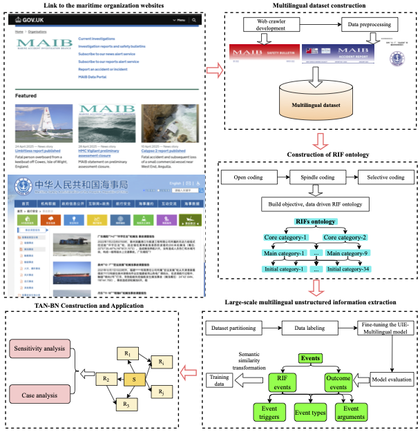
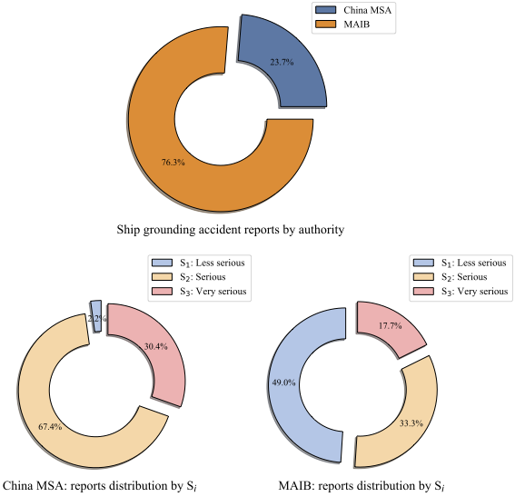
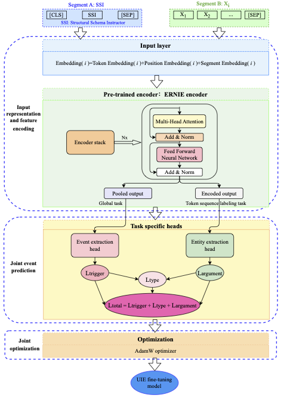
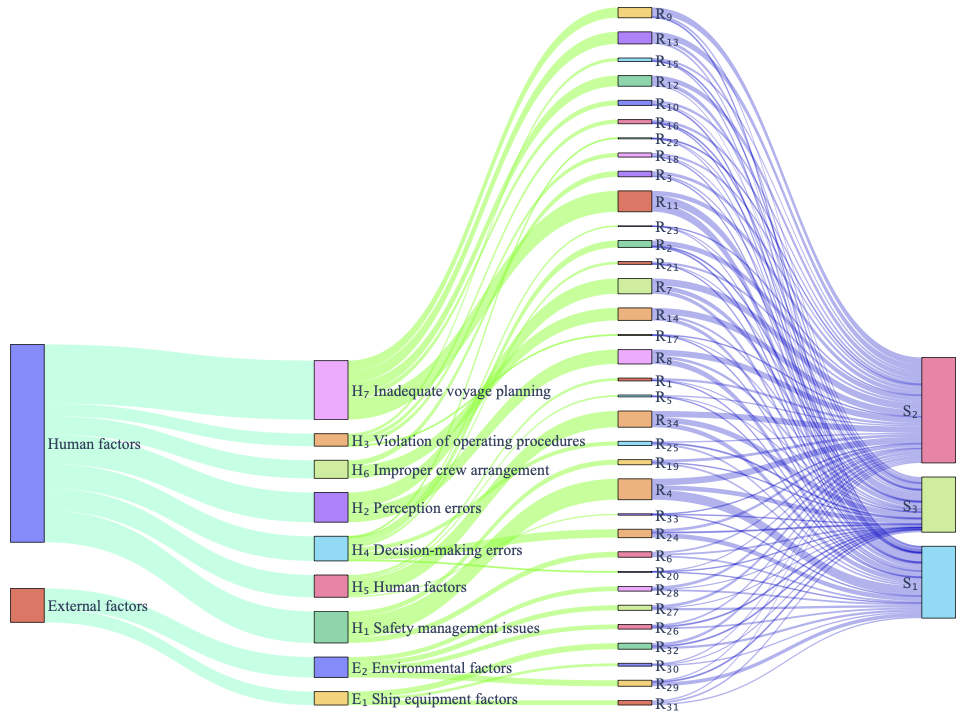

# An End-to-End Multilingual Framework for Intelligent Analysis of Risk Influence Factors in Ship Grounding Accidents
With the increasing demand for automation and cross-lingual analysis in maritime safety, analyzing ship grounding accidents presents significant challenges due to single-language data limitations, subjective identification of Risk Influential Factors (RIFs), and the lack of intelligent extraction from unstructured texts. To address these issues, this study develops an end-to-end multilingual intelligent framework that systematically identifies and analyzes key RIFs from ship grounding accident reports. The framework integrates four core technical modules: a web-crawling-based module for constructing a multilingual grounding accident dataset; an objective and accurate RIF ontology developed using Grounded Theory; an intelligent extraction module for multilingual unstructured information based on a fine-tuned Unified Information Extraction Multi-Language (UIE-Multilingual) model; and a sensitivity analysis and case validation module using the constructed TAN-BN model. Experimental results show that the proposed framework improves the F1 score for information extraction by 7.1\%--12.96\% compared to the optimal baseline model. It also confirms the accuracy of the TAN-BN construction through case studies and produces RIF analysis results consistent with domain expert conclusions. This framework reduces manual effort, enhances analytical accuracy and efficiency, supports intelligent processing of multilingual grounding accident data, and delivers reliable decision-making support for maritime safety management.

## Please refer to and cite the following for details: https://doi.org/10.1016/j.ress.2025.111788

| Png | PDF |
|-----------|-----------|
|  | [Fig1-1.pdf](./Fig1-1.pdf) |
|  | [Fig3-1.pdf](./Fig3-1.pdf) |
|  | [Fig7-1.pdf](./Fig7-1.pdf) |
|  | [Fig8-1.pdf](./Fig8-1.pdf) |
|  | [Fig9-1.pdf](./Fig9-1.pdf) |

# A large-scale pre-trained model based data-driven analysis method for maritime accidents
To address key challenges in analyzing Risk Influence Factors (RIFs) for maritime accidents, such as reliance on single-language data, subjectivity in RIF construction, and inefficiency in extracting information from large-scale unstructured sources, this study proposes an integrated intelligent framework that combines large-scale pre-trained models with data-driven analysis. The framework comprises four main steps. Firstly, 449 bilingual ship collision accident reports were collected via web crawling from the China Maritime Safety Administration and the UK Marine Accident Investigation Branch. Secondly, an objective RIF ontology was developed using Grounded Theory. Thirdly, the Unified Information Extraction Multi-Language model was fine-tuned using the bilingual corpus to enable intelligent information extraction and conversion into training data, with improvements in three extraction sub-tasks ranging from 3.96% to 41.45% over the baseline model. Finally, a Tree-Augmented Naïve Bayesian Network model was constructed based on the extracted data. The effectiveness of the framework was validated through model-based sensitivity and case analyses. This approach enables efficient and automated extraction of RIF-related knowledge from large-scale, multilingual accident datasets, significantly enhancing the intelligence level of RIF analysis while reducing manual effort and subjectivity. The proposed methodology provides a comprehensive and scalable solution for data-driven risk analysis in maritime safety research.

